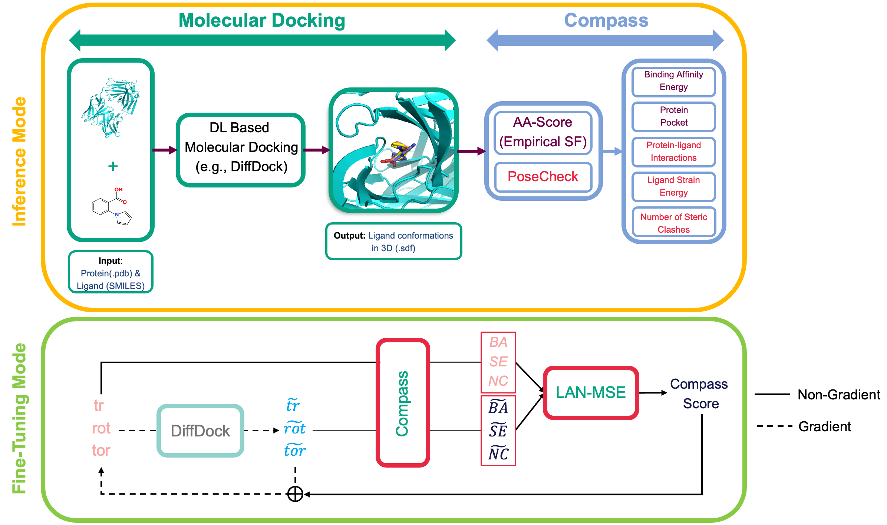

# CompassDock: Comprehensive Accurate Assessment Approach for Deep Learning-Based Molecular Docking in Inference and Fine-Tuning

<p float="center">
  
</p>


Official Implementation of *CompassDock: Comprehensive Accurate Assessment Approach for Deep Learning-Based Molecular Docking in Inference and Fine-Tuning* paper.


## Usage  <a name="usage"></a>

### Setup Environment  <a name="environment"></a>

Set up your development environment using [Anaconda](https://docs.anaconda.com/anaconda/install/index.html). Navigate to root directory and execute the following commands to create and activate the `CompassDock` environment:

```bash
conda env create --file environment.yml
conda activate CompassDock
```

For additional details on managing conda environments, refer to the [conda documentation](https://conda.io/projects/conda/en/latest/commands/env/create.html).


### Docking with CompassDock in Inference Mode <a name="inference"></a>

Our approach for inference aligns with the method used in [DiffDock](https://github.com/gcorso/DiffDock/blob/main/README.md#docking-prediction--). The same data formats are applicable here as well.

For protein inputs, you can use `.pdb` files or provide sequences that will be folded using ESMFold. For the ligands, inputs can be in the form of a SMILES string or files readable by RDKit, such as `.sdf` or `.mol2`.

To process a single complex, specify the protein using `--protein_path protein.pdb` or `--protein_sequence GIQSYCTPPYSVLQDPPQPVV`, and the ligand using `--ligand_description ligand.sdf` or `--ligand_description "COc(cc1)ccc1C#N"`.

If you want to do a redocking with recursion, you can use `--max_recursion_step`.

And you are ready to run inference for CompassDock with single complex:

```bash
python -W ignore -m main_inference --config DiffDock/default_inference_args.yaml  --protein_path example/proteins/1a46_protein_processed.pdb  --ligand_description  "C1=CN=C(N1)CCNC(=O)CCCC(=O)NCCC2=NC=CN2"  --out_dir results/user_predictions_small --max_recursion_step 2
```

You will get Binding Affinity Energy, Strain Energy of Ligand, Number of Steric Clashes of Complex and Interaction Type Information of Complex. Also, you'll get the protein pocket in `.pdb` in `pockets/` where you save your results in `--out_dir` to better understand the region of docked molecule in protein pocket.

If you have multiple protein target files and multiple ligand files/SMILES you want to run, give protein files' direction with `--protein_dir` and indicate the range of them with `--protein_start` and `--protein_end`. Also if you have `.txt` file containing SMILES, you can give the direction with `--smiles_dir` and range them with `--smiles_start` and `--smiles_end`.


Now you can run a couple of proteins and ligands at the same inference run:

```bash
python -W ignore -m main_inference --config DiffDock/default_inference_args.yaml  --protein_dir example/proteins  --smiles_dir  example/smiles.txt  --out_dir results/user_predictions_small --max_recursion_step 1  --protein_start 0 --protein_end 2 --smiles_start 0 --smiles_end 2
```


## Datasets  <a name="datasets"></a>


Only the PDBBind dataset is utilized in this project. The data processing guidelines provided in [DiffDock](https://github.com/gcorso/DiffDock/blob/main/README.md#datasets--) and the steps for generating [ESM Embeddings](https://github.com/gcorso/DiffDock/blob/main/README.md#generate-the-esm2-embeddings-for-the-proteins) are also applicable here.


### CompassDock in Fine-Tuning Mode <a name="finetuning"></a>

After generating ESM embeddings, run the Inference Mode once to download the pretrained DiffDock-L. Now, we're ready to finetune DiffDock with Compass:

```bash
python -W ignore -m finetune --config experiments/model_parameters.yml
```

### License

Modified MIT License for Academic and Non-Commercial Use

## Acknowledgements <a name="acknowledgements"></a>
We extend our deepest gratitude to the following teams for open-sourcing their valuable Repos:
* [DiffDock Team](https://github.com/gcorso/DiffDock) (version 2023 & 2024),
* [AA-score Team](https://github.com/Xundrug/AA-Score-Tool),
* [PoseCheck Team](https://github.com/cch1999/posecheck) 

